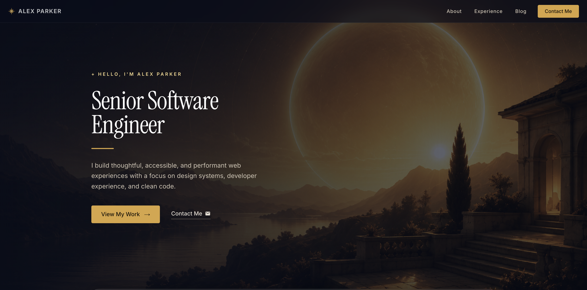

<div align="center">
  

  # Helios

  **A warm editorial portfolio template for engineers, designers, and creators.**

  Built with Next.js 16 · React 19 · Material UI 9 · TypeScript

  [](https://nextjs.org)
  [](https://react.dev)
  [](https://mui.com)
  [](https://www.typescriptlang.org)

</div>

---

## Preview



---

## Design

Helios pairs deep navy with warm gold — a palette that reads like candlelight against a night sky. The aesthetic is editorial and considered:

- **Warm-on-dark palette** — near-black navy backgrounds (`#080d1a`) offset by gold and amber accents (`#D9A441`) and warm cream text (`#F6F2EB`); richness without harshness
- **Serif-led typography** — Instrument Serif for all headings gives a literary, editorial weight; Inter handles body copy with quiet clarity; hierarchy comes from contrast between the two, not from decoration
- **Living ambient layer** — an animated canvas particle field with drifting constellation lines, parallax gradient auras, a cursor glow that trails the pointer, botanical sprig silhouettes, and a fine noise texture woven into the background
- **Minimal chrome** — no sidebars, no competing gradients in content areas; the work speaks, the interface recedes
- **Scroll-driven reveals** — content surfaces as you move through the page, each section arriving with quiet intention
- **Reduced-motion aware** — all animations respect `prefers-reduced-motion`

---

## What's included

- **Hero** — headline, subhead, and social links
- **About** — personal bio and summary
- **Experience** — chronological work history with company, role, and highlights
- **Testimonials** — pull-quote with avatar and attribution
- **Blog** — card grid of articles with individual post pages at `/blog/[slug]`; reading progress bar on post pages
- **Contact** — inbound contact form
- **Responsive navigation** — top nav collapses to a hamburger drawer on mobile
- **Page loader** — branded loading screen on initial visit
- **Custom 404** — styled not-found page
- **Scroll animations** — CSS-driven reveal system via Intersection Observer, no animation library required
- **SEO-ready** — server-side rendering, Metadata API, statically generated blog pages, optimized images

---

## Tech stack

| Layer | Technology |
|---|---|
| Framework | Next.js 16 (App Router) |
| UI | Material UI 9 + Emotion |
| Language | TypeScript 5 |
| Fonts | Instrument Serif + Inter via `next/font` |
| Runtime | React 19 |

---

## Getting started

```bash
npm install
npm run dev
```

Open [http://localhost:3000](http://localhost:3000).

---

## Customization

All content lives in one file:

**`app/helpers/config.ts`**

```ts
export const social = [...]        // GitHub, LinkedIn, X
export const experience = [...]    // Work history
export const blogPosts = [...]     // Blog post metadata
export const testimonials = [...]  // Pull quotes with attribution
export const education = [...]     // Education
```

The theme — colors, typography, component overrides — is in **`app/theme.ts`**.

---

## Project structure

```
app/
├── blog/[slug]/              # Dynamic blog post pages
├── components/
│   ├── Ambient.tsx           # Animated background: particle field, gradient auras, cursor glow, botanical sprigs, noise, scroll reveal
│   ├── BrandMark.tsx         # Logo / wordmark
│   ├── Hero.tsx
│   ├── About.tsx
│   ├── Experience.tsx
│   ├── Writing.tsx           # Blog card grid
│   ├── Testimonial.tsx       # Pull-quote section
│   ├── Contact.tsx
│   ├── Footer.tsx
│   ├── ResponsiveMenu.tsx    # Top nav + mobile hamburger drawer
│   ├── PageLoader.tsx        # Initial page load animation
│   └── ReadingProgress.tsx   # Progress bar on blog post pages
├── helpers/config.ts         # Site content (single source of truth)
├── theme.ts                  # MUI theme (palette, typography, component overrides)
├── globals.css               # Global styles + .reveal animation classes
├── layout.tsx                # Root layout with fonts and metadata
├── loading.tsx               # Next.js loading state
├── not-found.tsx             # Custom 404 page
├── providers.tsx             # MUI theme provider wrapper
└── page.tsx                  # Home page
```

---

## Deployment

```bash
npx vercel
```

All blog pages are pre-rendered at build time — fast, CDN-friendly, no runtime overhead.

---

## Scripts

| Command | Description |
|---|---|
| `npm run dev` | Start development server |
| `npm run build` | Production build |
| `npm run start` | Serve production build locally |
| `npm run lint` | Run ESLint |
